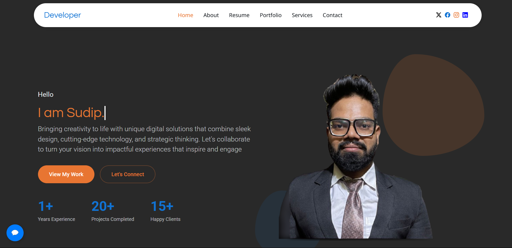

# Personal Portfolio
 <!-- Add a screenshot if available -->

Welcome to my personal portfolio website, showcasing my skills, projects, and professional journey.

## 🖥️ Live Demo
Check out the live version of my portfolio: [Sudip's Portfolio](https://sudipbera083.github.io/protfolio/)

## 📂 Repository
- Explore the complete code(Frontend) on GitHub: [GitHub Repository](https://github.com/SudipBera083/protfolio)
- Explore the complete code(Backend) on GitHub: [GitHub Repository](https://github.com/SudipBera083/Protfolio_backend)

## 🚀 Features

- **Responsive Design**: Works on all devices (mobile, tablet, desktop)
- **Modern UI**: Clean, professional interface with animations
- **Project Showcase**: Highlighted GitHub projects with descriptions
- **Skills Section**: Visual representation of technical skills
- **Contact Form**: Easy way for visitors to reach out
- **Dark/Light Mode**: Toggle between color schemes


## 🛠 Technologies Used

- **Frontend**:
  - HTML5, CSS3, JavaScript
  - Bootstrap 5
  - AOS (Animate On Scroll) library
  - Font Awesome icons
  - Google Fonts


- **Backend**:
  - Django
  - Django rest
  - SQLite

 
- **Hosting**:
  - GitHub Pages
  - Pyhton anywhere


## 📜 Setup Instructions
1. Clone the repository:
```bash
git clone https://github.com/SudipBera083/Protfolio_backend.git
```
2. Open the project folder:
```bash
cd protfolio
```
3. Open the index.html file in your browser.

## 💬 Contact
Feel free to reach out via [LinkedIn](https://www.linkedin.com/in/sudipbera083/) or [Email](mailto:sudipbera083@gmail.com).

---
Made with ❤️ by Sudip Bera


